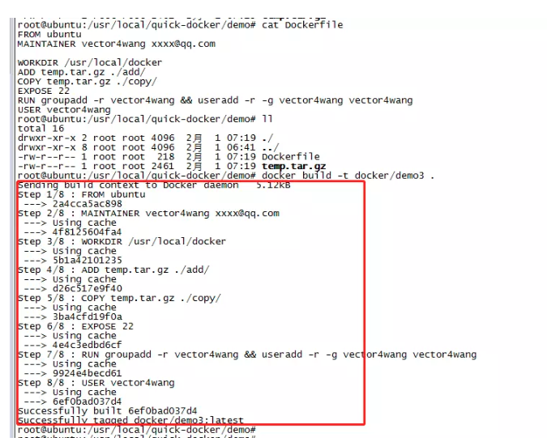
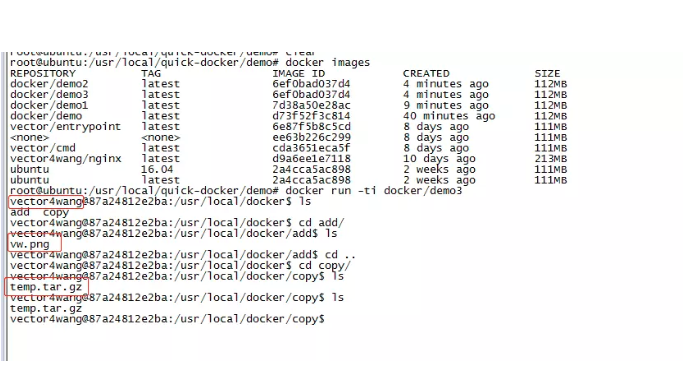

# 学习Docker之Dockerfile的命令

[原文](https://www.jianshu.com/p/10ed530766af)

[冬天只爱早晨](https://www.jianshu.com/u/223a1314e818)关注

42018.02.01 23:53:29字数 1,345阅读 24,471

使用Dockerfile去构建镜像好比堆积木、使用pom去构建maven项目一样，有异曲同工之妙，下面就把Dockerfile中主要的命令介绍一下。

## 组成部分

| 部分               | 命令                                                     |
| ------------------ | -------------------------------------------------------- |
| 基础镜像信息       | FROM                                                     |
| 维护者信息         | MAINTAINER                                               |
| 镜像操作指令       | RUN、COPY、ADD、EXPOSE、WORKDIR、ONBUILD、USER、VOLUME等 |
| 容器启动时执行指令 | CMD、ENTRYPOINT                                          |

详情:[官方文档](https://links.jianshu.com/go?to=https%3A%2F%2Fdocs.docker.com%2Fengine%2Freference%2Fbuilder%2F)

## 各命令详解

### FROM

指定哪种镜像作为新镜像的基础镜像，如：


```bash
FROM ubuntu:14.04
```

### MAINTAINER

指明该镜像的作者和其电子邮件，如：


```bash
MAINTAINER vector4wang "xxxxxxx@qq.com"
```

### RUN

在新镜像内部执行的命令，比如安装一些软件、配置一些基础环境，可使用\来换行，如：


```bash
RUN echo 'hello docker!' \
    > /usr/local/file.txt
```

也可以使用exec格式`RUN ["executable", "param1", "param2"]`的命令，如：


```bash
RUN ["apt-get","install","-y","nginx"]
```

要注意的是，**`executable`是命令，后面的param是参数**

### COPY

将主机的文件复制到镜像内，如果目的位置不存在，Docker会自动创建所有需要的目录结构，但是它只是单纯的复制，并不会去做文件提取和解压工作。如：


```bash
COPY application.yml /etc/springboot/hello-service/src/resources
```

**注意：需要复制的目录一定要放在Dockerfile文件的同级目录下**
原因：

> 因为构建环境将会上传到Docker守护进程，而复制是在Docker守护进程中进行的。任何位于构建环境之外的东西都是不可用的。COPY指令的目的的位置则必须是容器内部的一个绝对路径。
> ---《THE DOCKER BOOK》

### ADD

将主机的文件复制到镜像中，跟COPY一样，限制条件和使用方式都一样，如：


```bash
ADD application.yml /etc/springboot/hello-service/src/resources
```

但是ADD会对压缩文件（tar, gzip, bzip2, etc）做提取和解压操作。

### EXPOSE

暴露镜像的端口供主机做映射，启动镜像时，使用-P参数来讲镜像端口与宿主机的随机端口做映射。使用方式（可指定多个）：


```bash
EXPOSE 8080 
EXPOSE 8081
...
```

### WORKDIR

在构建镜像时，指定镜像的工作目录，之后的命令都是基于此工作目录，如果不存在，则会创建目录。如


```bash
WORKDIR /usr/local
WORKDIR webservice
RUN echo 'hello docker' > text.txt
...
```

最终会在`/usr/local/webservice/`目录下生成text.txt文件

### ONBUILD

当一个包含ONBUILD命令的镜像被用作其他镜像的基础镜像时(比如用户的镜像需要从某为准备好的位置添加源代码，或者用户需要执行特定于构建镜像的环境的构建脚本)，该命令就会执行。
如创建镜像image-A


```bash
FROM ubuntu
...
ONBUILD ADD . /var/www
...
```

然后创建镜像image-B，指定image-A为基础镜像，如


```bash
FROM image-A
...
```

然后在构建image-B的时候，日志上显示如下:


```log
Step 0 : FROM image-A
# Execting 1 build triggers
Step onbuild-0 : ADD . /var/www
...
```

### USER

指定该镜像以什么样的用户去执行，如：


```bash
USER mongo
```

### VOLUME

用来向基于镜像创建的容器添加卷。比如你可以将mongodb镜像中存储数据的data文件指定为主机的某个文件。(容器内部建议不要存储任何数据)
如：


```bash
VOLUME /data/db /data/configdb
```

注意:`VOLUME 主机目录 容器目录`

### CMD

容器启动时需要执行的命令，如：


```bash
CMD /bin/bash
```

同样可以使用exec语法，如


```bash
CMD ["/bin/bash"]
```

当有多个CMD的时候，只有最后一个生效。

### ENTRYPOINT

作用和用法和CMD一模一样

### CMD和ENTRYPOINT的区别

敲黑板！！！非常重要
**一定要注意！**

**一定要注意！**

**一定要注意！**
CMD和ENTRYPOINT同样作为容器启动时执行的命令，区别有以下几点：

#### CMD的命令会被 docker run 的命令覆盖而ENTRYPOINT不会

如使用`CMD ["/bin/bash"]`或`ENTRYPOINT ["/bin/bash"]`后，再使用`docker run -ti image`启动容器，它会自动进入容器内部的交互终端，如同使用
`docker run -ti image /bin/bash`。

但是如果启动镜像的命令为`docker run -ti image /bin/ps`，使用CMD后面的命令就会被覆盖转而执行`bin/ps`命令，而*ENTRYPOINT的则不会，而是会把docker run 后面的命令当做ENTRYPOINT执行命令的参数*。
以下例子比较容易理解
Dockerfile中为


```bash
ENTRYPOINT ["/user/sbin/nginx"]
```

然后通过启动build之后的容器


```bash
docker run -ti image -g "daemon off"
```

此时`-g "daemon off"`会被当成参数传递给ENTRYPOINT，最终的命令变成了


```bash
/user/sbin/nginx -g "daemon off"
```

#### CMD和ENTRYPOINT都存在时

CMD和ENTRYPOINT都存在时，CMD的指令变成了ENTRYPOINT的参数，并且此CMD提供的参数会被 docker run 后面的命令覆盖，如：


```bash
...
ENTRYPOINT ["echo","hello","i am"]
CMD ["docker"]
```

之后启动构建之后的容器

- 使用`docker run -ti image`

  输出“hello i am docker”

- 使用`docker run -ti image world`

  输出“hello i am world”

指令比较多，可以通过分类(如开头的表格)的办法去记忆

## 示例

自己写了个简单的示例，非常简单


```bash
FROM ubuntu
MAINTAINER vector4wang xxxx@qq.com

WORKDIR /usr/local/docker
ADD temp.zip ./add/
COPY temp.zip ./copy/
EXPOSE 22
RUN groupadd -r vector4wang && useradd -r -g vector4wang vector4wang
USER vector4wang

ENTRYPOINT ["/bin/bash"]
```

下面是运行过程





(动态图太大了上传不了)

注意 登录之后的用户名和ADD、COPY进去的文件

## 后记

以上只是自己通过看书写demo和浏览其他人的博文所总结出来的，之后在实战的过程中会把遇到的一些实际问题追加进来。

参考： [https://www.cnblogs.com/lienhua34/p/5170335.html](https://links.jianshu.com/go?to=https%3A%2F%2Fwww.cnblogs.com%2Flienhua34%2Fp%2F5170335.html)

CSDN：[http://blog.csdn.net/qqhjqs?viewmode=list](https://links.jianshu.com/go?to=http%3A%2F%2Fblog.csdn.net%2Fqqhjqs%3Fviewmode%3Dlist)
博客：[http://blog.wangxc.club/](https://links.jianshu.com/go?to=http%3A%2F%2Fblog.wangxc.club%2F)
简书：https://www.jianshu.com/u/223a1314e818
Github:[https://github.com/vector4wang](https://links.jianshu.com/go?to=https%3A%2F%2Fgithub.com%2Fvector4wang)
Gitee:[https://gitee.com/backwxc](https://links.jianshu.com/go?to=https%3A%2F%2Fgitee.com%2Fbackwxc)
如果感觉有帮助的话，点个赞哦~